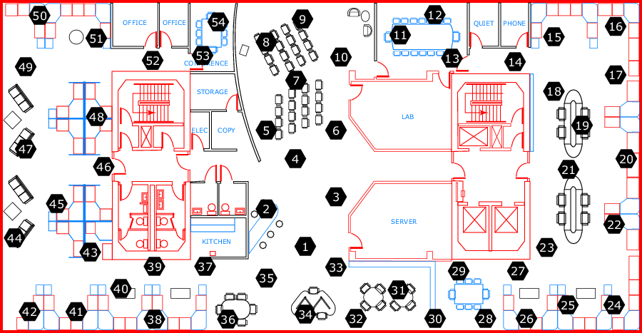

## Análise de Séries Temporais com CNN, GRU e LSTM

### Esses dados são coletados de 54 sensores implantados no laboratório Intel Berkeley Research entre 28 de fevereiro e 5 de abril de 2004.

Sensores Mica2Dot com weatherboards coletaram informações de topologia com registro de data e hora, juntamente com valores de umidade, temperatura, luz e voltagem uma vez a cada 31 segundos. Os dados foram coletados usando o sistema de processamento de consultas na rede TinyDB, construído na plataforma TinyOS.

### No tratamento dos dados, foram eliminadas informações de 2 sensores, restando apenas 52.

Os sensores foram organizados no laboratório de acordo com o diagrama mostrado abaixo:

Para mais informações sobre os dados acesse:
[https://www.kaggle.com/datasets/divyansh22/intel-berkeley-research-lab-sensor-data/data](https://www.kaggle.com/datasets/divyansh22/intel-berkeley-research-lab-sensor-data/data)